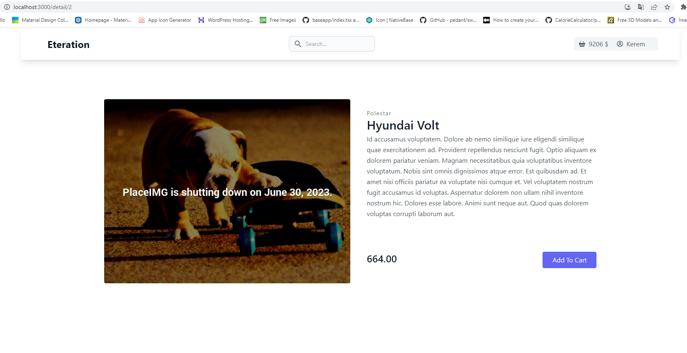

# E-Commerce Project

This is a responsive e-commerce project developed using ReactJS, Redux Toolkit, and Tailwind CSS. The project aims to provide a user-friendly and visually appealing e-commerce website where users can browse products, add them to the cart, and proceed to checkout.

## Features

- Product listing with search and filtering options
- Product details page with information and add-to-cart functionality
- Shopping cart management with the ability to update quantities and remove items
- Responsive design for seamless user experience on different devices

## Technologies Used

- ReactJS: A JavaScript library for building user interfaces
- Redux Toolkit: A state management library for managing application state
- Tailwind CSS: A utility-first CSS framework for designing responsive UIs
- React Router: A routing library for handling navigation within the application
- Fetch: A JavaScript library for making HTTP requests
- MockAPI: A mock API service for simulating backend functionality

## Installation

To run the project locally, follow these steps:

1. Clone the repository: `git clone https://github.com/umtcn/react-ecommerce.git`
2. Navigate to the project directory: `cd react-ecommerce-main`
3. Install dependencies: `npm install`
4. Start the development server: `npm start`
5. Open your browser and visit: `http://localhost:3000`

## Screenshots

Here are some screenshots from the project:

## Contributing

Contributions are welcome! If you have any ideas, suggestions, or bug reports, please open an issue or submit a pull request.

## License

This project is licensed under the MIT License. See the [LICENSE](LICENSE) file for more details.

## Contact

For any inquiries or feedback, feel free to reach out to me at [umutcan.ata06@gmail.com](mailto:umutcan.ata06@gmail.com).

## Demo

https://react-ecommerce-wine.vercel.app/
